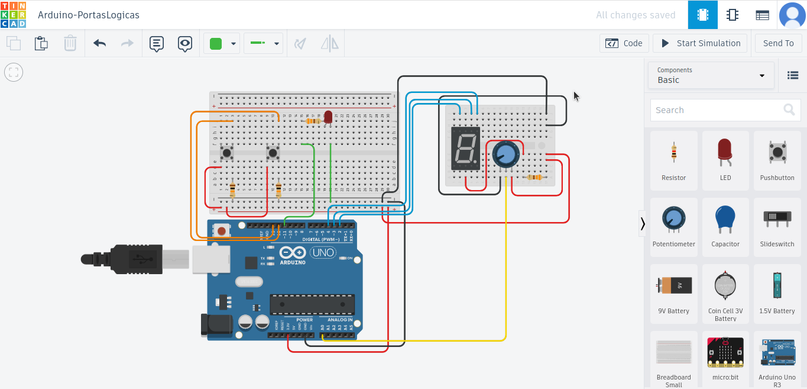
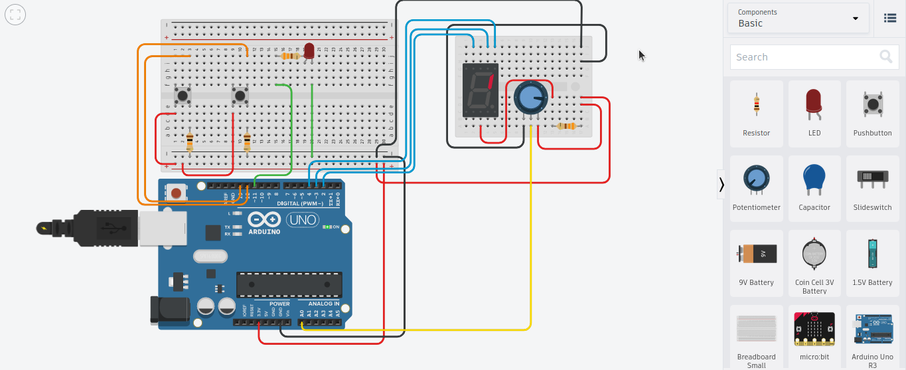
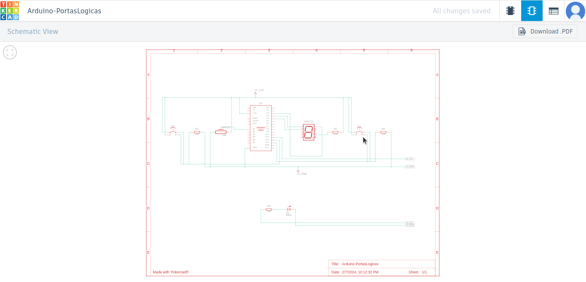

# Arduino - Portas Lógicas

### Componentes Utilizados:
|Componente|Quantidade|
|---|---|
|Arduino Uno / NodeMCU|1|
|Chave Táctil|2|
|Display 7 Segmentos (ânodo comum)|1|
|LED (qualquer cor)|1|
|Potenciômetro 10k ohms|1|
|Resistor 330 ohms|2|
|Resistor 10k ohms|2|

### Sobre
Um projeto relativamente simples como forma de me introduzir ao Arduino. A ideia é **simular portas lógicas** com o uso de dois botões e um LED.

O tipo de porta pode ser selecionado girando o potenciômetro e observando o display. Atualmente, as portas disponíveis são:

(0: desativado | 1: ativo | X: indiferente)

- #### NOT:
  |Botão 1|Botão 2|Resultado|
  |---|---|---|
  |0|X|1|
  |1|X|0|

- #### OR:
  |Botão 1|Botão 2|Resultado|
  |---|---|---|
  |0|0|0|
  |1|0|1|
  |0|1|1|
  |1|1|1|

- #### AND:
  |Botão 1|Botão 2|Resultado|
  |---|---|---|
  |0|0|0|
  |1|0|0|
  |0|1|0|
  |1|1|1|

### Diagrama de Circuito:
